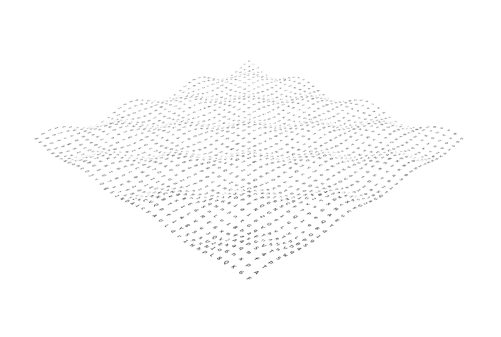

# 3D Wave Words

> Module: C - Front-End Development / Difficulty: Easy

Create a wave animation with random words consisting of uppercase and lowercase English letters and numbers in a 40x40 grid.

The wave animation should make each random word move up and down in a 3D wave pattern along the Z-axis over time, repeating infinitely.

You can only write code in the provided script.js file.

(Refer to demo.mp4)

> Marking aspect:

- There are 40x40 = 1600 random words consisting of uppercase and lowercase English letters and numbers. 0.10
- Each random word moves up and down in a 3D wave pattern along the Z-axis over time, repeating infinitely. 0.60
- The functionality was completed by writing code only in the provided script.js file. 0.30
