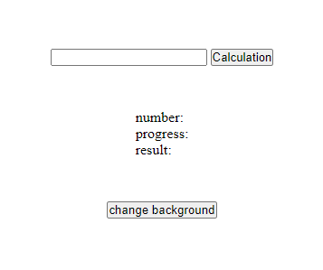

# Asynchronous calculation

> Module: C - Front-End Development / Difficulty: Easy

When you input a desired number n and start the calculation, the sum of all numbers from 1 to n appears in the `result`.

The number entered by the user is displayed in `number`, and the calculation percentage is shown in `progress`.

While calculating, if you press the `Calculation` button, the message `Already calculating` is displayed and does not affect the ongoing calculation.

The calculation should not affect the current browser UI operation. To test this, press the `change background` button to change the background color.

The calculation must use the following logic (you can modify the function but not the calculation logic):

```javascript
function sumNumber(n) {
    let result = 0;
    for (let i = 1; i <= n; i++) {
        result += i;
    }
    return result;
}
```



---

> Marking aspect:
 - Used the provided HTML and CSS files. 0.20
 - When you click Calculation, the result is calculated accurately. 0.10
 - While calculating, the progress increases in proportion to the calculation time. 0.35
 - While calculating, when you press the change background button, the background color changes randomly. 0.35