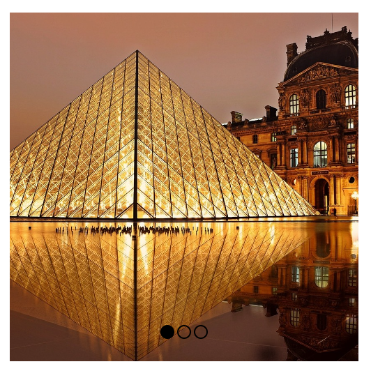

# Carousel - Key control

> Module: B - Layout / Difficulty: Normal

Create a carousel using the given images.

There are buttons at the bottom center to control the slides, and when you press the buttons, it moves to the corresponding order.

Click on the carousel, pressing the arrow keys (left, right) slides it left or right. (It doesn't move left in the first image and doesn't move right in the third image)

Buttons that allow you to manipulate slides change their background color depending on the current slide situation.

(You can use html and css, but not javascript)

---

> Marking aspect:
 - The carousel area is implemented and uses the provided images. 0.10
 - There are clickable buttons at the bottom center of the carousel area that allow you to manipulate the slides, and the style changes depending on the slide situation. 0.40
 - When you click the button, it will move in that order. 0.10
 - Click on the carousel area and press the arrow keys to move left and right. (It doesn't move left in the first image and doesn't move right in the third image) 0.40