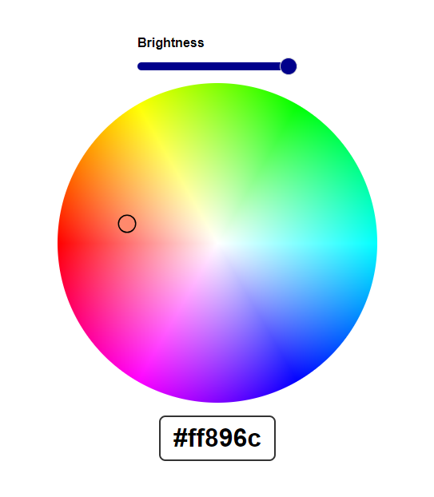

# Color wheel

> Module: C - Front-End Development / Difficulty: Normal

When a color is selected, the selected color is displayed as a hex value, and you can see where the selected part is on the color wheel.

Adjusting the brightness will change the color of the color wheel and the selected color value accordingly. Brightness can be adjusted using a slider.

> Marking aspect:
 - A circular color wheel, a brightness adjuster, and a hexadecimal result value are displayed. 0.10
 - Clicking on the circular color wheel shows the currently selected color with a marker. 0.20
 - You can adjust the brightness using the brightness adjuster, which is reflected in the color wheel and the hexadecimal result value. 0.30
 - When you select a color on the color wheel and adjust the brightness, the hexadecimal result value changes instantly to the correct value. 0.40