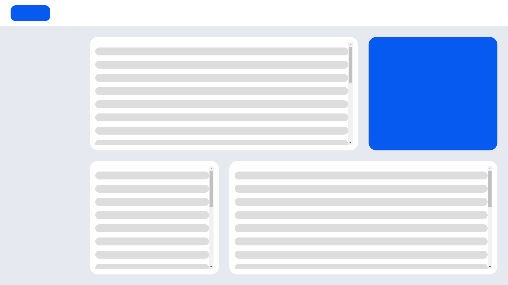

# Dashboard Layout

> Module: B - Layout / Difficulty: Normal

Modify the provided file to create the layout as shown in the image below.

You can only modify the `your-work.css` file and cannot change any other files.

There should be no scrolls except for the list scroll inside the section, and the list content should not overflow the section.

---

> Marking aspect:
 - There is no other scrolling except for the list scroll inside the section. 0.30
 - The list content does not exceed the section and scrolls. 0.30
 - The functionality was implemented by only modifying the provided your-work.css file. 0.40
