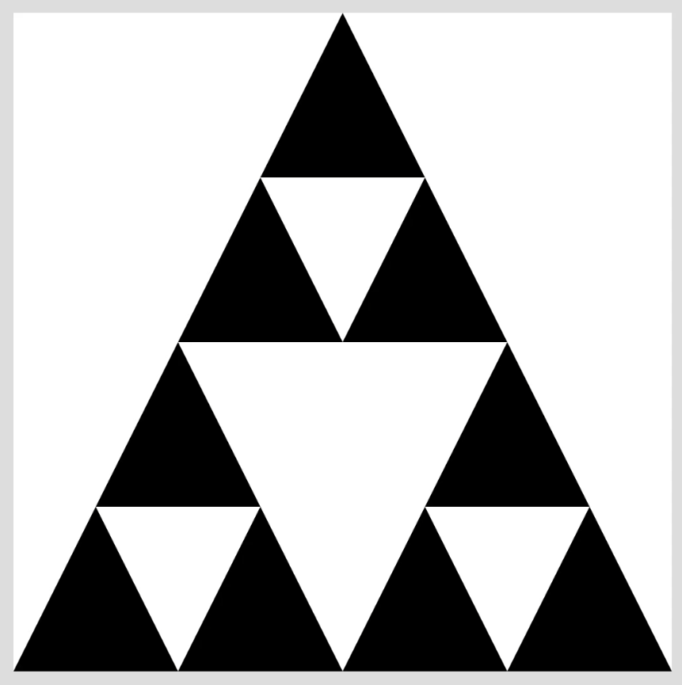

# Fractal Triangle

> Module: C - Front-End Development / Difficulty: Easy

After entering the number of iterations and pressing the button, you should draw the Fractal structure by repeating it the specified number of times.

(Refer to demo.mp4)

> Marking aspect:
 - There is a canvas area, a form to input numbers, and a button. 0.20
 - After entering the number of iterations and clicking the button, a fractal image is drawn. 0.30
 - The drawn image has the same fractal structure as shown in the video (equilateral triangle structure). 0.50