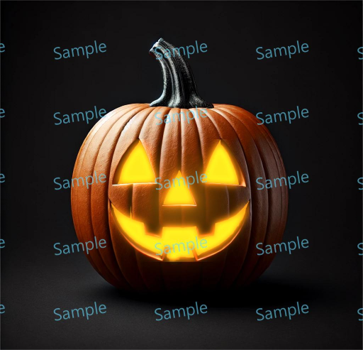

# Add Glow

> Module: A - Website Design / Difficulty: Normal

Implement a Glow effect on the provided first image to make it look like the second image.

The completed work file should be saved as result.png.

	
	

---

> Marking aspect:
 - Implemented the same glow effect as in the document photo. 0.70
 - The name of the saved file is result.png. 0.20
 - Created it using the provided asset.png. 0.10