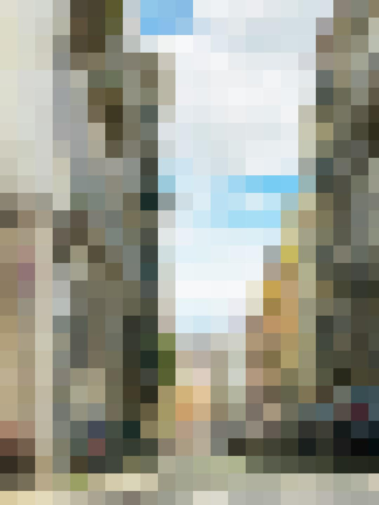

# Image Mosaic

> Module: D - Back-End Development / Difficulty: Easy

You need to dynamically create a mosaic of the provided image.

The completed image should be made up of square cells, with each cell having the average color value of the corresponding area of the original image.

The size of the cells can be set using the query parameter `cell_size`. If `cell_size` is not provided, it should be set to 50px.

Example) When cell size is 50px:

> Marking aspect:
 - The mosaic is created according to the size specified by the `cell_size` query parameter. 0.60
 - If the `cell_size` query parameter is not provided, the mosaic is created with cells of size 50px. 0.30
 - The mosaic image is the same size as the original image. 0.10