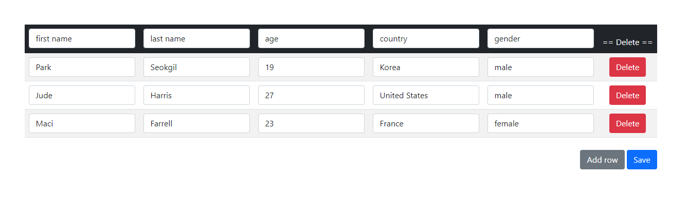

# Local Table Data Control

> Module: D - Back-End Development / Difficulty: Easy

Read the provided `table.json` file and display it to the user in table format.

The user can modify the table data (fields, rows) and add or delete rows.

Added or deleted data is saved directly to `table.json`, and modified table data is saved by pressing the save button.

> Marking aspect:
 - The correct data is displayed to the user based on the provided JSON. 0.20
 - When the delete or add button is pressed, the changes are immediately reflected in the JSON. 0.30
 - When the save button is pressed, the modified data is reflected in the JSON (including fields). 0.30
 - Data that has been deleted, added, or modified is saved correctly according to the existing JSON structure. 0.20