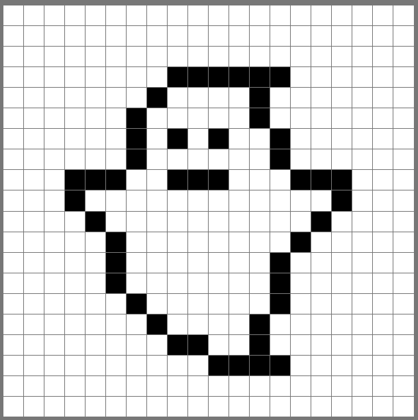
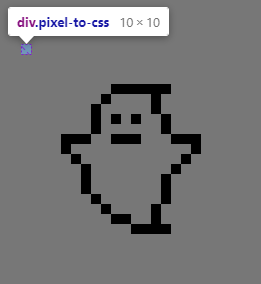

# Pixel Art

> Module: C - Front-End Development / Difficulty: Difficult

There is a pixel art drawing board of 20 x 20 size.

You can draw and erase with the desired color on the drawing board.

When you press the `Copy` button, the pixel art drawn by the user is converted to the css `box-shadow` property and copied to the clipboard.

Below is an example of pixel art being converted to the css `box-shadow` property and copied to the clipboard. (The class name and width and height must all be copied together.)



``` css
.pixel-to-css {
    box-shadow: 90px 40px 0 0 #000000, 100px 40px 0 0 #000000, 110px 40px 0 0 #000000, 120px 40px 0 0 #000000, 130px 40px 0 0 #000000, 140px 40px 0 0 #000000, 80px 50px 0 0 #000000, 130px 50px 0 0 #000000, 70px 60px 0 0 #000000, 130px 60px 0 0 #000000, 70px 70px 0 0 #000000, 90px 70px 0 0 #000000, 110px 70px 0 0 #000000, 140px 70px 0 0 #000000, 70px 80px 0 0 #000000, 140px 80px 0 0 #000000, 40px 90px 0 0 #000000, 50px 90px 0 0 #000000, 60px 90px 0 0 #000000, 90px 90px 0 0 #000000, 100px 90px 0 0 #000000, 110px 90px 0 0 #000000, 150px 90px 0 0 #000000, 160px 90px 0 0 #000000, 170px 90px 0 0 #000000, 40px 100px 0 0 #000000, 170px 100px 0 0 #000000, 50px 110px 0 0 #000000, 160px 110px 0 0 #000000, 60px 120px 0 0 #000000, 150px 120px 0 0 #000000, 60px 130px 0 0 #000000, 140px 130px 0 0 #000000, 60px 140px 0 0 #000000, 140px 140px 0 0 #000000, 70px 150px 0 0 #000000, 140px 150px 0 0 #000000, 80px 160px 0 0 #000000, 130px 160px 0 0 #000000, 90px 170px 0 0 #000000, 100px 170px 0 0 #000000, 130px 170px 0 0 #000000, 110px 180px 0 0 #000000, 120px 180px 0 0 #000000, 130px 180px 0 0 #000000, 140px 180px 0 0 #000000;
    width: 10px;
    height: 10px;
}
```



(Refer to demo.mp4)


---

> Marking aspect:
 - There is a pixel art board size 20 x 20, and each cell must be visible and distinct. 0.25
 - Each pixel can be changed to any color you want or erased. 0.25
 - There is a Copy button, and clicking it should copy the box-shadow code of the same image as the Painter image, which can be used in CSS, to the clipboard. 0.50
 - The copied code has the same format as the specified code. (Spacing doesn't matter) 0.50