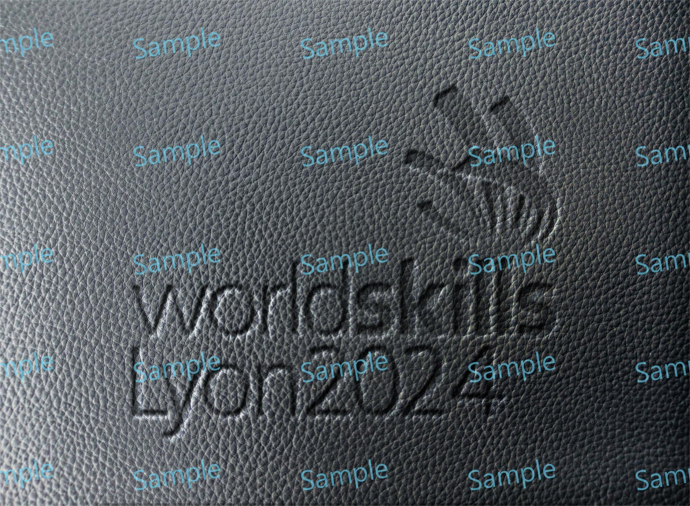

# Logo Pressed Effect

> Module: A - Website Design / Difficulty: Normal

Using the provided logo.png and asset.jpg, create a Pressed effect identical to the photo below.

The completed work file should be saved as result.png.

---

> Marking aspect:
 - Implemented the same pressed effect as in the document photo. 0.70
 - The name of the saved file is result.png. 0.20
 - Created it using the provided asset.png and logo.png. 0.10