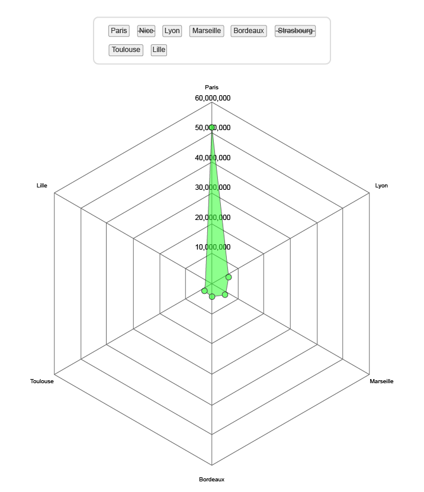

# Radar Chart

> Module: C - Front-End Development / Difficulty: Normal

Create a radar chart with a legend using the provided `data.json`.

When you click on an item in the legend or a vertex of the chart data, that item becomes deactivated.

The data for the deactivated item will not be visible in the chart area, and the item in the legend will have a strikethrough.

Clicking on a deactivated item in the legend will reactivate the item.

When the chart is first drawn, and when items are activated/deactivated, the legend chart will play an animation spreading from the center.

> Marking aspect:

 - A radar chart using data.json is displayed (including a legend). 0.30
 - When you select an item in the legend or a vertex on the chart, the corresponding item is deactivated and reflected in the chart. 0.20
 - Clicking on a deactivated item in the legend reactivates it and reflects it in the chart. 0.20
 - Each time an item is deactivated or reactivated, the radar chart performs an animation. 0.30
