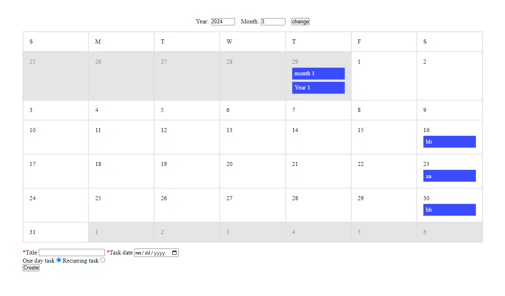

# Recurring Calendar

> Module: D - Back-End Development / Difficulty: Difficult

The player must create a recurring calendar. The schedules should be managed in a database, with each schedule (including recurring ones) having a single row.

You can select the Title, Task Date, and Is recurring, and only if recurrence is enabled, you can input the Type, Cycle, and End Date. (The calendar may include parts of the previous month and the next month.)

Type can be one of Day, Week, Month, or Year, and the schedule will repeat every Cycle number of Types.
(e.g., if Type is Week and Cycle is 2, the schedule repeats every 2 weeks.)

If the date of a recurring schedule exceeds the last day of the month in which it should appear, it will be displayed on the last day of that month.

Users can change the year and month of the displayed calendar.

> Marking aspect:

 - There is a form to change the date, a calendar for the currently selected month, and a form to add events. 0.10
 - A single schedule can be added. 0.10
 - Recurring schedules can be added. 0.50
 - Single schedules are displayed correctly. 0.10
 - Recurring schedules are displayed correctly (if the day of a recurring schedule is beyond the last day of the month, it is displayed on the last day of the month; only recurrences after the task date are shown on the calendar). 1.00
 - The date on the calendar can be changed. 0.20