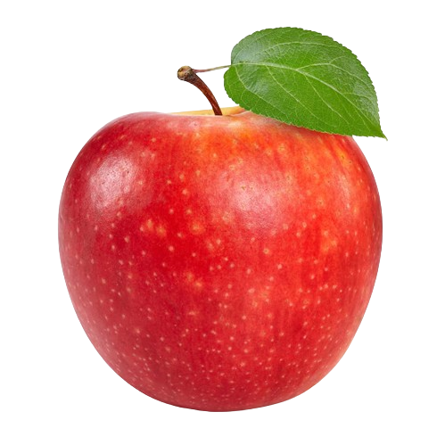
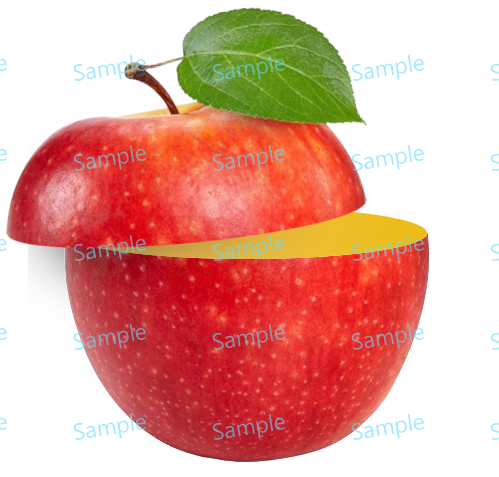

# Apple Slice

> Module: A - Website Design / Difficulty: Normal

When the left image below is provided as asset.png, you need to implement a sliced effect on the apple as shown in the right image.

The sliced section should have a slight gradient.

The completed work file should be saved as result.png.

	
	

---

> Marking aspect:
 - Implemented the same sliced effect as in the document photo. 0.60
 - There is a slight gradient on the sliced section. 0.10
 - The name of the saved file is result.png. 0.20
 - Created it using the provided asset.png. 0.10