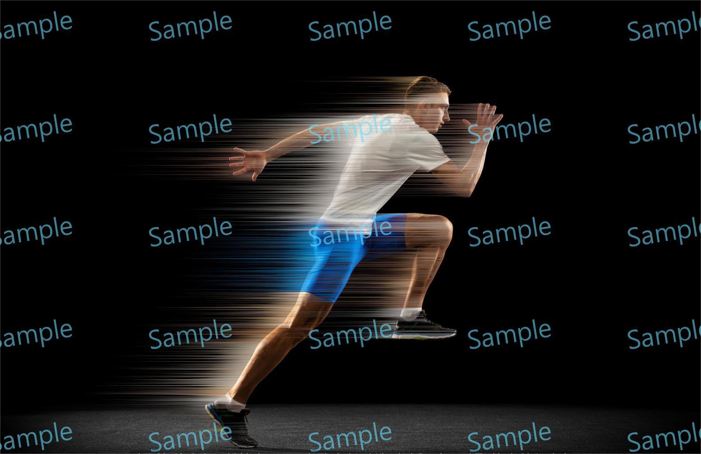

# Speed Effect

> Module: A - Website Design / Difficulty: Easy

You need to create a Speed Effect similar to the photo below.

The completed work file should be saved as result.png.

---

> Marking aspect:
 - created an effect similar to the one in the photo in the document. 0.70
 - The name of the saved file is result.png. 0.20
 - Used the provided asset.jpg. 0.10