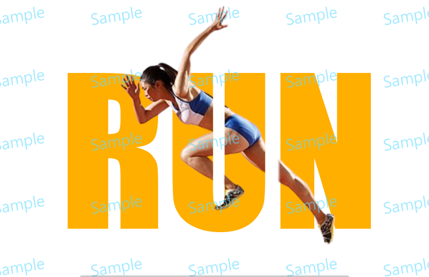

# Text Mask

> Module: A - Website Design / Difficulty: Easy

Using the text "RUN" and the provided asset.png, create a mask effect identical to the photo below.

The completed work file should be saved as result.png.

(The color of the "RUN" text should be #FFAF00.)

---

> Marking aspect:
 - Implemented the mask effect identical to the photo in the document. 0.70
 - The name of the saved file is result.png. 0.20
 - Created it using the text "RUN" and the provided asset.png. 0.10