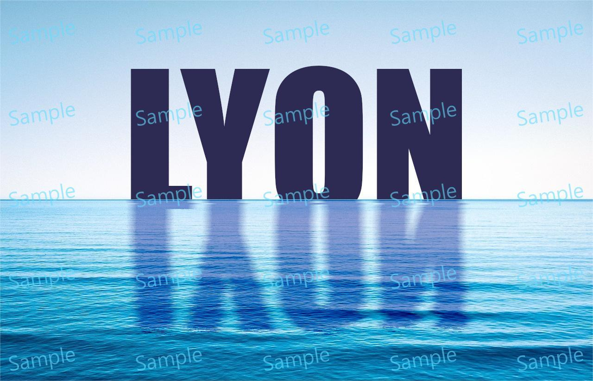

# Text Water Blur Effect

> Module: A - Website Design / Difficulty: Normal

Place the text "LYON" over the provided asset.jpg to create a water reflection blur effect as shown in the image below.

(The color of the "LYON" text should be #2D2B53.)

The completed work file should be saved as result.png.

---

> Marking aspect:
 - Placed the text "LYON" over the asset.jpg image in a position similar to the sample photo. 0.10
 - The "LYON" text has a similar water blur effect as shown in the document's photo. 0.60
 - The name of the saved file is result.png. 0.20
 - Created it using the text "LYON" and the provided asset.png. 0.10